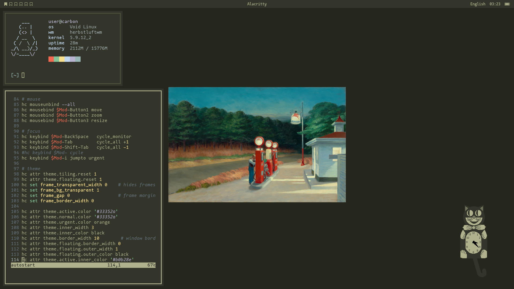

```
distro          void
wm              herbstluftwm
x compositor    picom
bar             polybar
editor          nvim
launcher        rofi
```

---

##### To do
- [ ] rewrite bar using herb hooks
- [ ] modify colors
- [ ] dark/light theme toggle

### Fonts
The font is mononoki, and in some cases the Nerd Fonts patched variant is used for unicode glyphs.
* [mononoki](https://madmalik.github.io/mononoki/)
* [mononoki Nerd Font (V2.0.0)](https://github.com/ryanoasis/nerd-fonts/releases/tag/v2.0.0)
        *v2.1.0 breaks some wide glyphs; skipping version*
---


